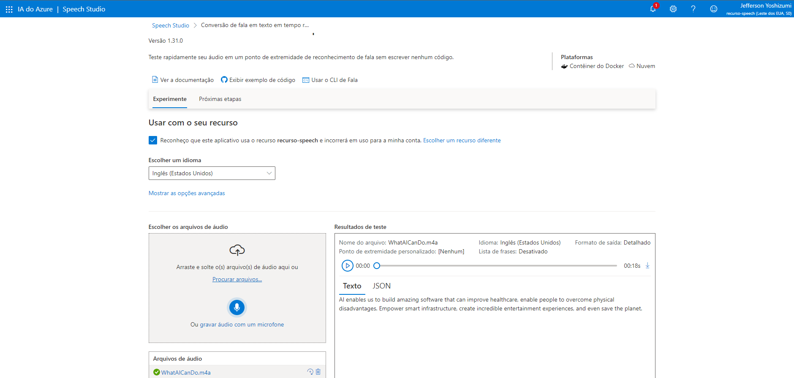
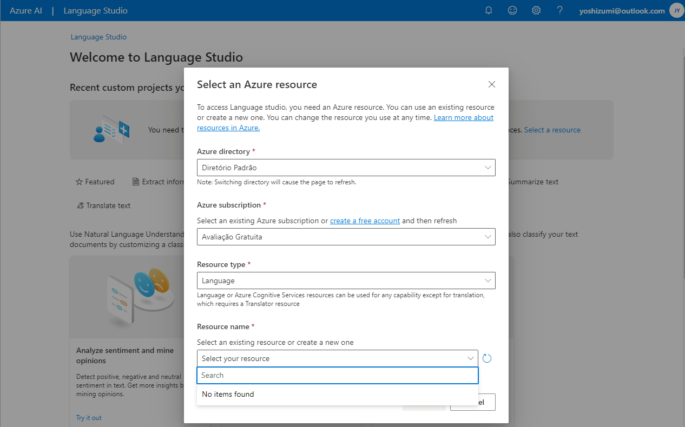

# Aula: Análise de Sentimentos com Language Studio no Azure AI

Passo a passo do projeto Análise de Sentimentos com Language Studio no Azure AI.

Links importantes:

[Explore Speech Studio](https://microsoftlearning.github.io/mslearn-ai-fundamentals/Instructions/Labs/09-speech.html)

[Analyze text with Language Studio](https://microsoftlearning.github.io/mslearn-ai-fundamentals/Instructions/Labs/06-text-analysis.html)

[Speech.zip](https://aka.ms/mslearn-speech-files)

## Exercício 1: Explore Speech Studio

Nesta lição iremos criar um recurso de IA do tipo Speech, dentro do recurso de serviços Azure AI.

Primeiro acessamos o portal Azure AI Speech Studio no endereço: https://speech.microsoft.com/.

Selecionar o serviço Conversão de fala em texto em tempo real.

Baixar o arquivo de áudio [Speech.zip](https://aka.ms/mslearn-speech-files), descompactar e subir o arquivo WhatAICanDo.m4a.

À medida que o serviço vai analisando, a resposta vai aparecendo do lado direto da tela:

Este é o [resultado](./output/realtime-text-to-speech.json) no formato json.

Feito isto, está concluído o exercício e podemos excluir o grupo de recursos para não consumir créditos no portal Azure.

## Exercício 2: Analyze text with Language Studio

Neste exercício iremos explorar a capacidade da linguagem do Azure AI para analisar alguns reviews de hotéis. Será utilizado o Language Studio para entender se os reviews são majoritariamente positivos ou negativos.

Primeiro devemos acessar o portal Azure no endereço: https://portal.azure.com/.

Criar um recurso do tipo Language service, seguindo as opções default.

Após a criação do recurso, acessar o endereço https://language.cognitive.azure.com/

Deu problema ao criar este recurso pois ele não aparece disponível no portal language:

Já fiz o refresh na caixa ao lado e também já fiz a criação umas 5 vezes.